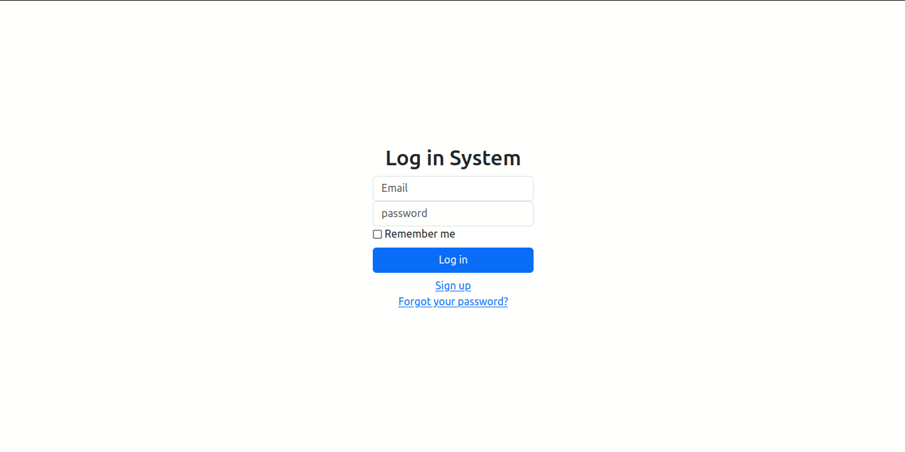

# Log in System  

### login is a autentication system to become a system secure using email and password. This project shows how to create an account, login, edit and logout.

    <a href="#author"> 🔎	About the Author</a>

<h4 align="center">
Project status: ✅Done
</h4>

### 📝 Features

- [x] login using e-mail

### 🧐 Demonstration

<h1 align=center>

</h1>

## 👩🏻‍💻 How to test this application

### ✅Prerequisites

- [x] Computer(duh)
- [x] Basic Ruby and Ruby on Rails skills
- [x] Basic Linux and Terminal skills
- [x] Ruby 3.3.4 installed
- [x] Ruby on Rails 7.2.1 installed
- [x] Yarn 1.22.22 installed
- [x] npm 10.8.3 installed
- [x] PostgreSQL 17.0 installed

### 👨🏻‍💻 Testing the web application

- Clone this repository and save in your desktop directory
- cd login_app
- bundle install
- rails db:create
- rails db:migrate
- rails server

## 🌐 Used Tecnologies

- [Ruby](https://www.ruby-lang.org/pt/)
- [Ruby on Rails](https://rubyonrails.org/)
- [Devise Gem](https://rubygems.org/gems/devise)
- [Bootstrap](https://getbootstrap.com/)

### 🙋‍♂️ Author
---

<a href="https://www.linkedin.com/in/edercirino/">

 

<b>Éder Cirino</b></a>

Made with ❤️ for Éder Cirino 👋 Get in touch

